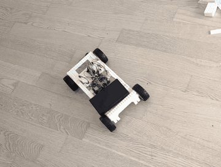
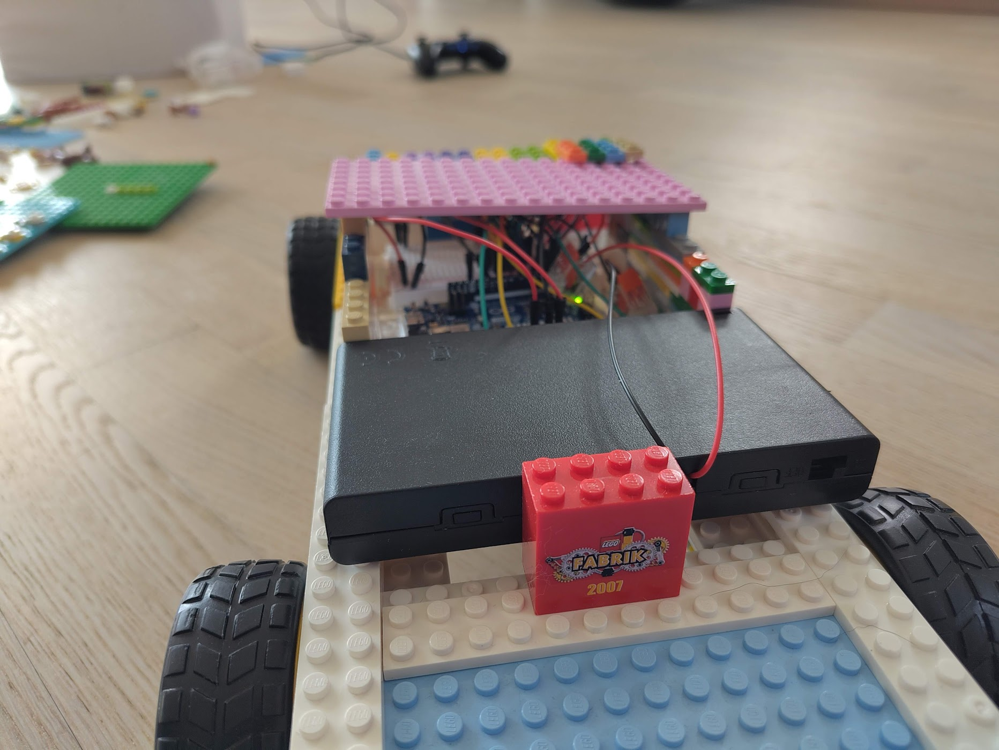
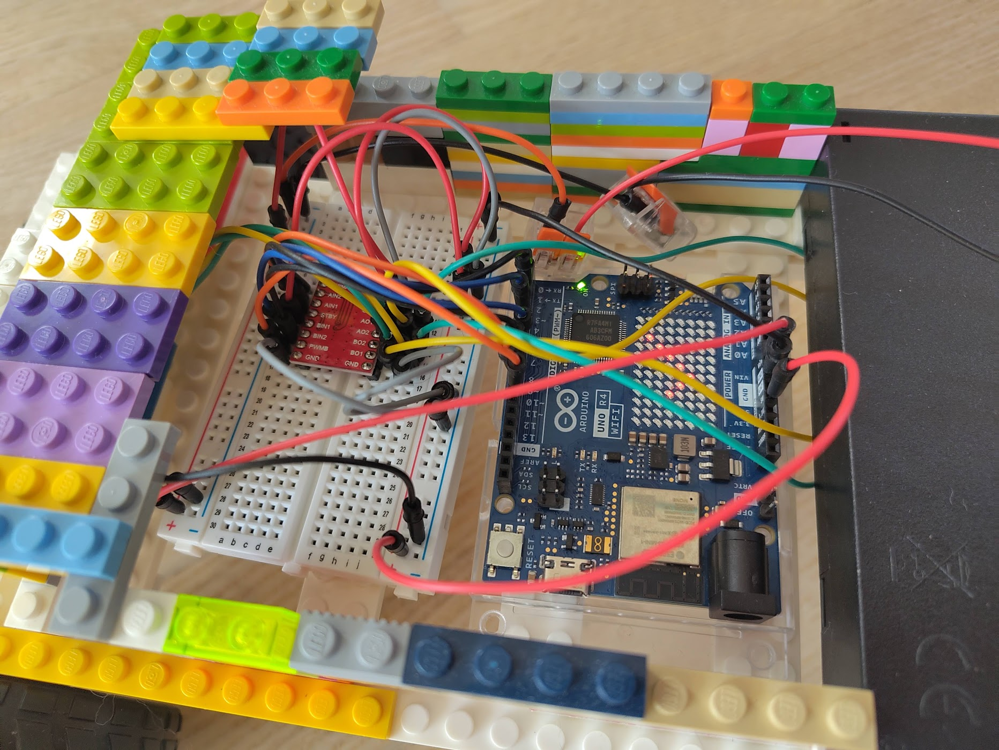
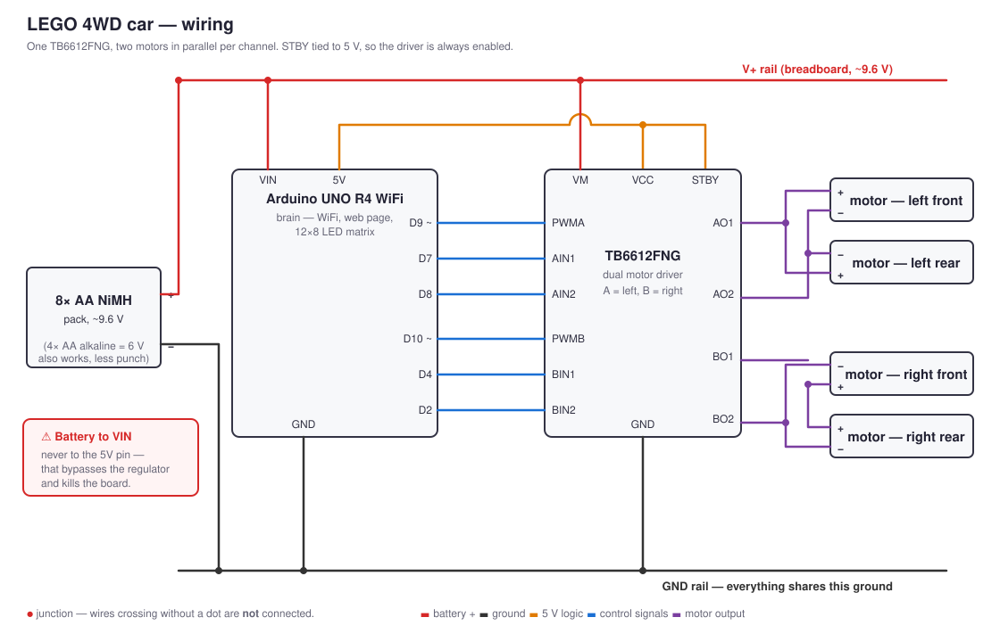
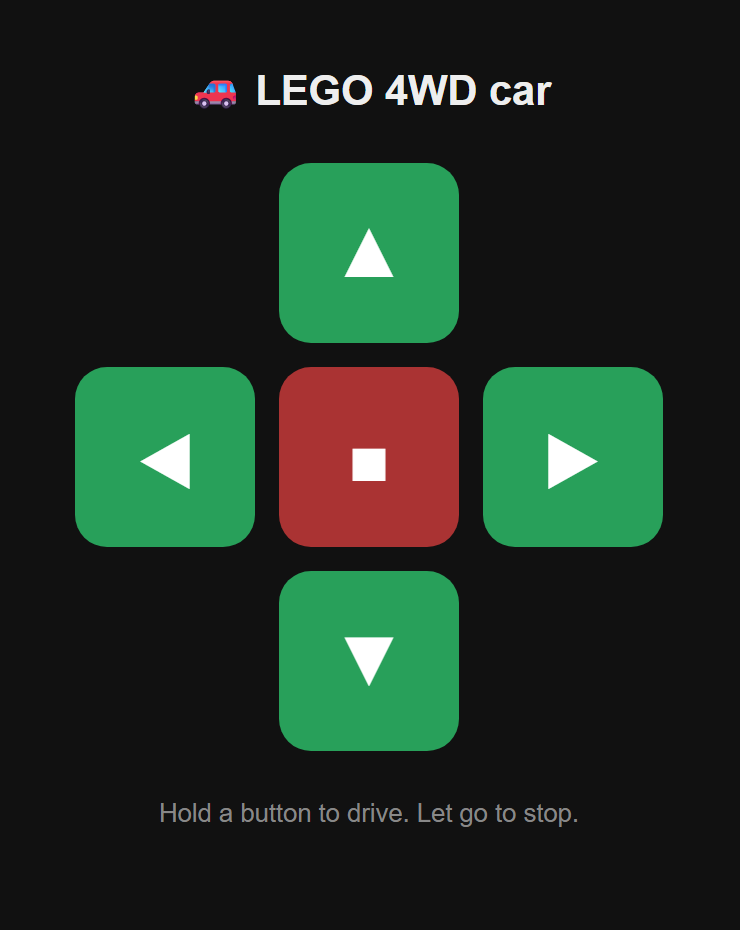
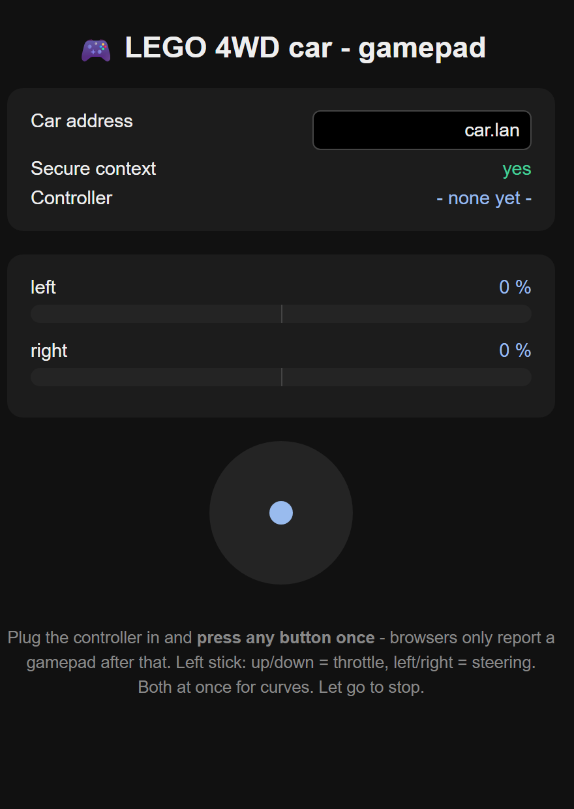

# 🚙 LEGO 4WD car — Arduino UNO R4 WiFi

A four-wheel-drive LEGO car you steer from your phone or a game controller over
your home WiFi. Built with two kids (4 and 8) in small, testable steps — every part
of it is meant to be understood, not just copied.

<p align="center">
  
</p>

<p align="center"><em>
  <a href="images/video/lego4wd-driving.mp4">▶ full video</a>
</em></p>

| | |
|---|---|
|  |  |
| The whole thing: LEGO frame, battery pack slung under the deck, electronics on top. | Under the roof — Arduino, breadboard and the TB6612 motor driver. |

## What it does

- **Drives from any phone or tablet.** The Arduino serves a small web page with
  arrow buttons. No app, no pairing, no cloud — just a browser on your home network.
- **Drives from a game controller.** A second page reads the analog stick and mixes
  it into tank steering, so you get proportional throttle and smooth curves.
- **Four-wheel drive, skid steering.** Both left wheels turn together, both right
  wheels turn together. Turn by running one side faster than the other.
- **Updates over WiFi.** After the first USB upload, new firmware goes on the car in
  about 20 seconds while it sits on the floor.
- **Stops on its own.** If commands stop arriving — finger off the button, browser
  closed, WiFi dropped — the motors cut out after 800 ms.
- **Says what it is doing.** The Arduino's built-in 12×8 LED matrix shows the WiFi
  state: check mark, cross, or searching dots. On battery there is no serial monitor,
  so this is the only debugging you get.

## Build it

| Step | |
|------|--|
| 1 | **[Parts list](docs/parts-list.md)** — roughly €55–70 of electronics, plus LEGO you already own |
| 2 | **[3D printed parts](docs/3d-printed-parts.md)** — four motor brackets, the only printed pieces (buyable too) |
| 3 | **[Soldering](docs/soldering.md)** — pin headers and motor wires; a good first soldering project |
| 4 | **[Wiring](docs/wiring.md)** — the full connection table and why each wire is where it is |
| 5 | **[Build notes](docs/build-notes.md)** — the mistakes we made, so you can skip them |
| — | **[Troubleshooting](docs/troubleshooting.md)** — when it does not work |
| — | **[Next steps](docs/next-steps.md)** — second motor driver, lights, horn |

### Wiring at a glance



The Arduino never drives a motor directly — it only sends signals to the TB6612
driver, which switches the battery current through to the motors. Details and the
full pin table are in **[docs/wiring.md](docs/wiring.md)**.

> ⚠️ The battery goes to **VIN**, never to the **5V** pin. The 5V pin sits behind the
> board's regulator; feeding a 9.6 V pack into it destroys the board.

### Flash it

Install [arduino-cli](https://arduino.github.io/arduino-cli/) and the board core once:

```bash
arduino-cli core install arduino:renesas_uno
```

Put in your WiFi credentials:

```bash
cp firmware/lego4wd/arduino_secrets.h.example firmware/lego4wd/arduino_secrets.h
```

Then compile and upload over USB:

```bash
arduino-cli compile --fqbn arduino:renesas_uno:unor4wifi firmware/lego4wd
```

```bash
arduino-cli upload -p COM4 --fqbn arduino:renesas_uno:unor4wifi firmware/lego4wd
```

Watch the serial output to find the car's IP address and MAC:

```bash
arduino-cli monitor -p COM4 -c baudrate=115200
```

Reserve a fixed IP for that MAC in your router. If your router can add local DNS
names, give it one — typing `http://car.lan` beats typing an IP address, especially
for an eight-year-old.

**Before the first drive:** prop the car up so the wheels spin in the air, and start
with the test sketches in [`firmware/tests/`](firmware/tests) — blink, then one
motor, then all four. Each one tells you something different is broken.

## Drive it

<table>
<tr>
<td width="42%"></td>
<td width="58%"></td>
</tr>
<tr>
<td><b>Phone / tablet</b><br>Open <code>http://&lt;car-address&gt;/</code>. The page is
served by the Arduino itself and lives in the sketch. Hold a button to drive, let go
to stop.</td>
<td><b>Game controller</b><br>Open <a href="controller/gamepad/index.html"><code>controller/gamepad/index.html</code></a>
<b>locally</b> — analog throttle, proportional steering, live readout of both sides.</td>
</tr>
</table>

The gamepad page has to be opened locally (`file://`, or `python -m http.server` and
then `http://localhost:8000`) — **not** served from the Arduino. Browsers only hand
out the Gamepad API in a *secure context*, and plain `http://<ip>/` is not one. The
page tells you whether it got one. Also: press a button on the controller once,
otherwise the browser will not report it at all.

Both pages talk to the same endpoints:

| Request | Meaning |
|---------|---------|
| `GET /forward` `/back` `/left` `/right` | fixed-speed steps, used by the arrow buttons |
| `GET /drive?l=-100..100&r=-100..100` | proportional, per side, in percent |
| `GET /stop` | stop now |
| `GET /` | the phone page |

The pages send **percent**, never raw PWM. The speed cap that protects the motors
lives in the sketch and cannot be overridden from outside.

### Update over WiFi

Once a sketch with the OTA receiver is on the car, the cable can stay in the drawer:

```bash
./tools/ota-upload.sh
```

```powershell
.\tools\ota-upload.ps1 -Address car.lan
```

Both scripts compile, POST the `.bin` to port 65280 with basic auth, and wait for the
car to come back online.

## What is in here

```
firmware/
  lego4wd/            the real firmware: WiFi, web page, OTA, motor control
  tests/              build it up in steps: blink → one motor → all four
controller/
  gamepad/            the game controller page (open locally)
tools/
  ota-upload.sh       push new firmware over WiFi (Linux/macOS)
  ota-upload.ps1      the same for Windows
docs/                 parts, wiring, soldering, build notes, troubleshooting
images/               diagram, photos, screenshots, video
```

## Safety

There are children involved, so:

- Motors always run through the driver and off their own battery — **never** off an
  Arduino pin.
- Check `VCC`/`GND` polarity together, out loud, before switching anything on.
- Every motor test starts with the car **propped up**, wheels in the air.
- Only an adult holds the soldering iron.
- Measure the motor voltage with a multimeter before raising `SPEED_MAX`. The motors
  are rated 3–6 V and the pack delivers ~9.6 V.

## Next steps

Planned, with the pin budget already worked out in
**[docs/next-steps.md](docs/next-steps.md)**:

- **A second TB6612** so every wheel gets its own channel — more current, no more
  parallel motors fighting over 1.2 A.
- **Headlights, brake lights, a beacon and a horn**, mapped to the controller
  buttons. Carried inside the existing drive command as a bitmask, so it costs zero
  extra HTTP requests — which matters more than you would think, see
  [build-notes.md](docs/build-notes.md).
- **A face on the LED matrix** instead of the WiFi status.
- HTTP keep-alive, battery monitoring, an ultrasonic "do not hit the wall" sensor.

## Thanks

To my cousin **Marcel**, who 3D printed the motor brackets for us — the one part of
this build we could not have improvised half as well.

## License

[MIT](LICENSE) — do what you like with it. If you build one, we would love to see it.

LEGO® is a trademark of the LEGO Group, which does not sponsor, authorise or endorse
this project.
