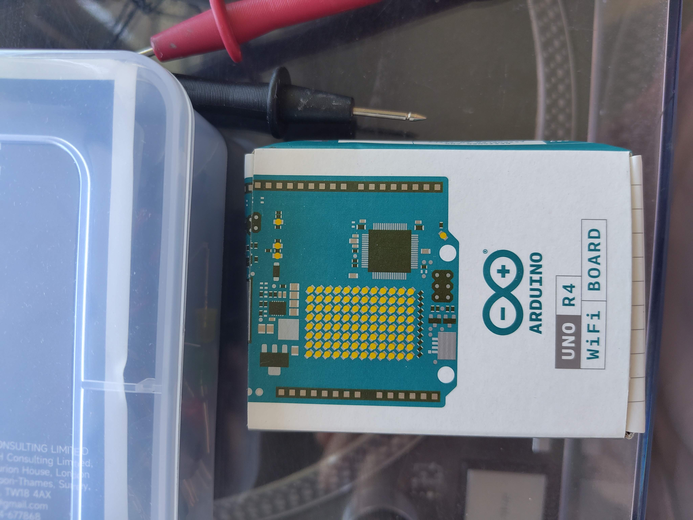
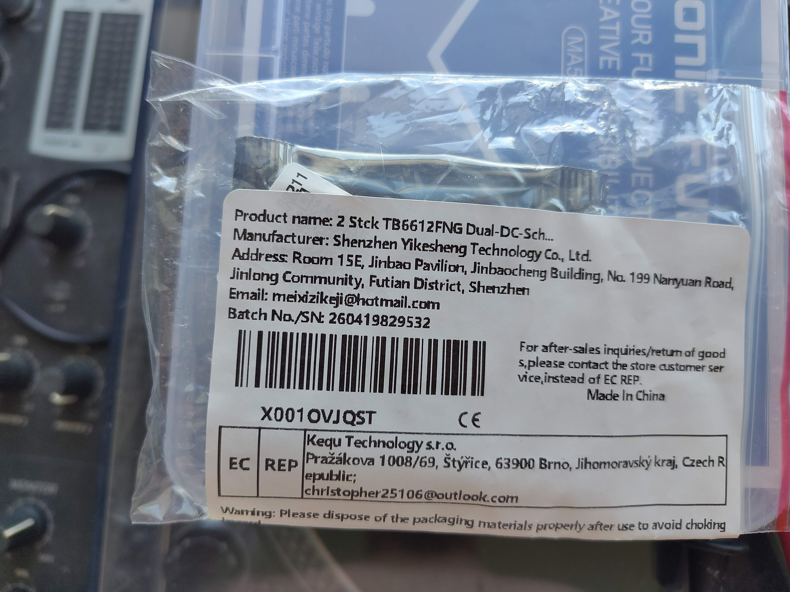
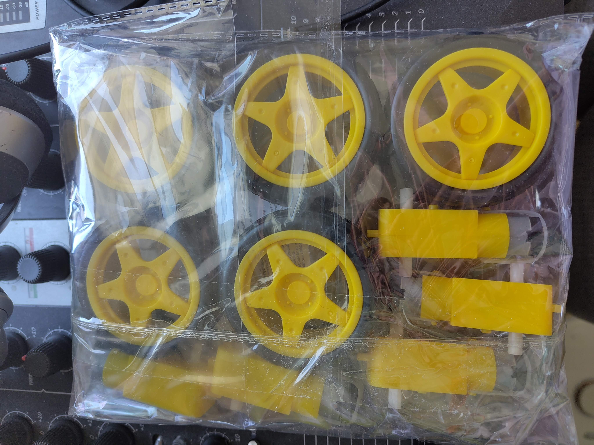
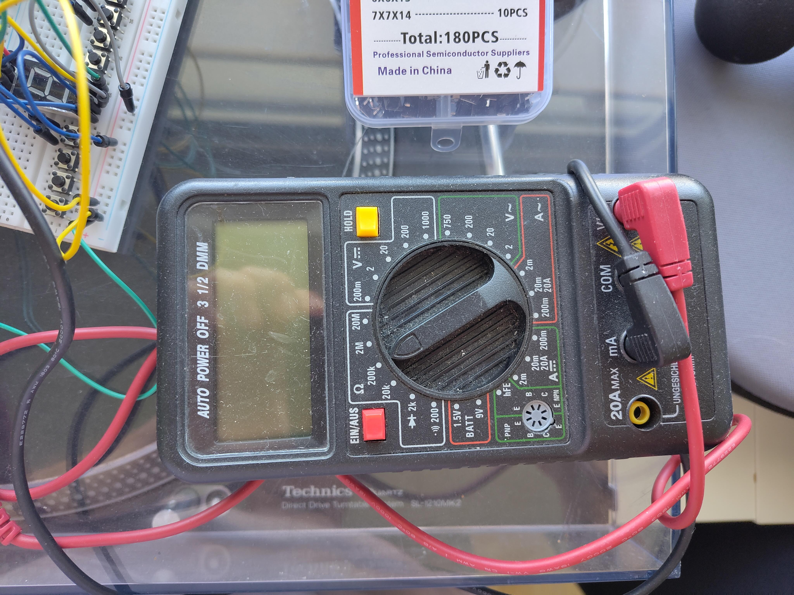

# Parts list

Everything here is cheap, widely available hobby electronics. Nothing is
soldered permanently to the LEGO, so the bricks survive the project.

## Electronics

| Qty | Part | What it does | Notes |
|----|------|--------------|-------|
| 1 | **Arduino UNO R4 WiFi** | The brain. Runs the web server, talks WiFi, drives the motor driver. | [store.arduino.cc](https://store.arduino.cc/products/uno-r4-wifi). Has WiFi *and* a 12×8 LED matrix on board — both are used here. An UNO R3 will **not** work (no WiFi). |
| 1 | **TB6612FNG dual motor driver** | The muscle. Takes battery current and switches it to the motors, with direction and PWM speed. | Search *"TB6612FNG breakout"*. Usually ships with unsoldered pin headers — see [soldering.md](soldering.md). A second one is optional — it gives each motor its own channel, see [build-notes.md](build-notes.md). |
| 4 | **Yellow TT gear motors** (3–6 V) | Drive the wheels. | The classic yellow plastic gearbox motors. Buy 5 — one spare, they are the part most likely to fail. |
| 4 | **Wheels for TT motors** | | Usually sold together with the motors. |
| 1 | **8× AA battery holder** + **8 AA cells** | Power for everything. | NiMH rechargeables give ~9.6 V and can deliver real current. Alkalines work (12 V, sagging) but a 4×AA holder at 6 V is gentler on the driver. A holder **with a switch** is worth the extra euro. |
| 1 | **Breadboard**, 830 tie points | Wiring without soldering. | A half-size board is enough and fits better on the car. |
| ~20 | **Jumper wires** (M-M and F-M) | | |
| 1 | **Multimeter** | Check the motor voltage before you cook a motor. | Any €10 unit does. |

**Nice to have**

| Qty | Part | What for |
|----|------|----------|
| 4 | 0.1 µF ceramic capacitors (marked `104`) | Soldered across each motor's terminals they damp the electrical noise the brushes make. Not needed for the first test, worth it once all four motors run. |
| 1 | Soldering iron + thin solder | For the pin headers on the driver and for the motor wires. See [soldering.md](soldering.md). |
| — | Rubber bands | Poor man's tyres. Slip them over the wheels for grip on hard floors. |
| 1 | **USB game controller** | Optional second way to drive — anything the browser Gamepad API sees. We use a GameSir T4 Pro; an Xbox or PlayStation pad works the same. |
| 3 | **LEDs** (red, blue, green) + resistors | Lights on the controller buttons. 1 kΩ each, except green which wants ~500 Ω — see [wiring.md](wiring.md) for why, and why **not** the 220 Ω every tutorial tells you. |

**For the controller straight on the car (no laptop)**

| Qty | Part | What for |
|----|------|----------|
| 1 | **ESP32 DevKit** with **Bluetooth Classic** | Pairs with the controller and feeds the Arduino over one wire. Must be a classic ESP32 (e.g. ESP32-D0WD), **not** an S2/S3/C3 — those only do Bluetooth LE, and most gamepads speak Classic. We use a DOIT ESP32 DEVKIT V1. ⚠️ Check whether yours is a WROOM or a WROVER module; on WROVER, GPIO16/17 are unusable, see [troubleshooting.md](troubleshooting.md). |
| 1 | **5 V step-down converter** (MP1584EN or similar) | Its own supply from the battery. Do **not** run it off the Arduino's 5 V pin — that is how we killed our first board. Set it to 5.0 V with no load and measure before connecting. |

## What the main parts look like

| | | |
|---|---|---|
|  |  |  |
| Arduino UNO R4 WiFi | TB6612FNG breakout — note the pin labels, the wiring table uses exactly these names | TT gear motors and the matching wheels |

A **multimeter** is not optional here. You need it twice: to check the motor voltage
before you cook a motor, and to check your solder joints for bridges. A €10 unit is
fine. It is also the single best way to make electricity visible to a child — a
number that changes when you do something is a lot more convincing than a lecture.

 

## LEGO

Whatever you have. What matters:

- a **flat base plate** big enough for the battery holder, the Arduino and the breadboard
  (ours is roughly 16×24 studs);
- four **motor mounts** — see [3d-printed-parts.md](3d-printed-parts.md);
- a few **plates and bricks** to box the electronics in and to build a roof over it.

Duplo works for the frame too, if your builders are on the younger side.

## Cost

Roughly €55–70 for the electronics if you buy the Arduino new; less if you already
have a starter kit. The LEGO is assumed to be lying around already.
