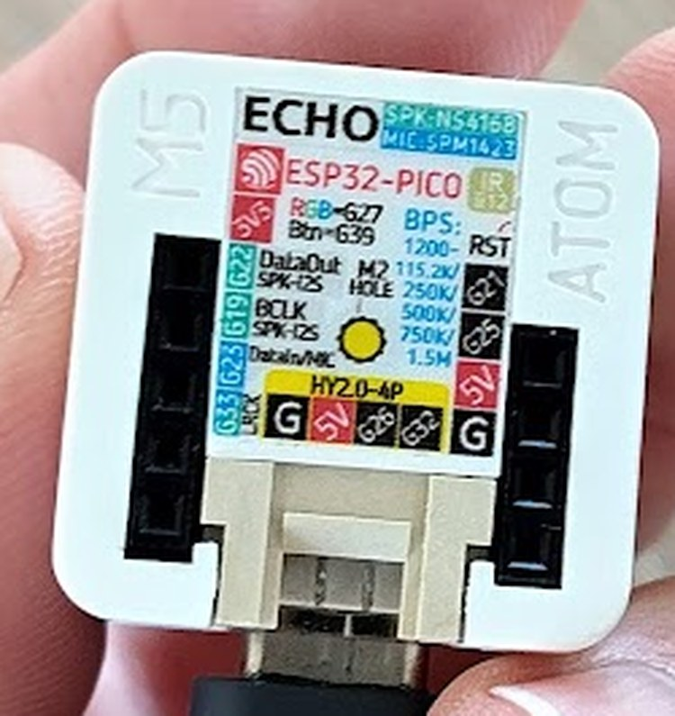

# Sound

Ask a four-year-old what a car is missing and the answer is not "proportional
steering". It is **noise**. So the car got an **M5Stack ATOM Echo**: a 24 mm cube
with its own ESP32, a small speaker and a microphone.

What it plays today:

| Sound | When |
|-------|------|
| **Horn** — a low two-tone "toooot" | while **Y** on the controller is held (or the top of the cube is pressed) |
| **Starter motor** — "rrr-rrr-rrr-VROOM" | when the controller connects — a nice "we're ready" |
| **Reversing beeper** — beep … beep … | while the car drives backwards |

The firmware is [firmware/atom-sound/](../firmware/atom-sound/).



## Why this part

- It has its **own brain** (ESP32-PICO-D4). The Arduino only says *what* is going
  on; *how* that sounds is worked out in the cube. The Arduino's job — motors,
  safety, the dead man's switch — stays small and boring, which is exactly how we
  want it.
- Speaker, amplifier (NS4168) and microphone are already inside. Nothing to solder.
- 24 × 24 mm and 9 g. It disappears into the LEGO.

> ⚠️ **Not to be confused with the "Atomic Echo Base"**, which is only a speaker
> base *without* a processor, meant to go under a separate ATOM controller. Look at
> the label on the back: it has to say **ECHO** and **ESP32-PICO**.

<br clear="all">

## Wiring

The ATOM has two headers on its bottom. The **5-hole** one belongs to the speaker and
the microphone — leave it alone. We use the **4-hole** one. Counted from the end
**away from** the white Grove socket:

| Hole | Pin | Connect to |
|------|-----|------------|
| 1 | `G21` | nothing (the firmware listens here too, see below) |
| 2 | `G25` | Arduino **`D1`** through a divider — see below |
| 3 | `5V` | **5 V** from the step-down converter (the same one as the ESP32 bridge) |
| 4 | `GND` | Arduino **`GND`** — a wire of its **own**, straight to a GND pin |

```
Arduino D1 ──[1 kΩ]──┬── ATOM G25
                     │
                  [2 kΩ]
                     │
Arduino GND ─────────┴── ATOM GND
```

**Why the divider?** The Arduino's pins put out 5 V, the ATOM's pins only tolerate
3.3 V. Two resistors fix that: 5 V × 2 kΩ / (1 kΩ + 2 kΩ) = 3.3 V. The other
direction (ESP32 → Arduino, for the gamepad) needs nothing, because 3.3 V is already a
valid HIGH for the Arduino — that asymmetry catches people out constantly.

**Why listen on two pins?** The print on the cube is tiny. The firmware listens on
`G25` **and** `G21` at the same time, with a receiver each, so it does not matter which
of the two holes the wire ends up in.

> ⚠️ **5 V from the converter and USB must never be connected at the same time** —
> two supplies would fight each other. New firmware only goes on over USB, so:
> **pull the 5 V wire first**, then plug in USB.

> ⚠️ **Check with a multimeter before connecting the 5 V wire.** The breadboard's plus
> rail carries the raw battery voltage (9.6 V), not 5 V. See
> [troubleshooting.md](troubleshooting.md) — that is how we killed an ESP32.

## What goes down the wire

The car sends one line, in plain text:

```
L,R,horn,gamepad      e.g.  "-150,-150,0,1"
```

- `L`, `R` — the motor speeds left and right, minus = backwards
- `horn` — 1 while honking
- `gamepad` — 1 while a controller is connected

It goes out whenever something changes (horn and controller at once, speeds at most
every 50 ms) and otherwise every **200 ms** as a heartbeat. If the heartbeat stops,
the ATOM falls silent by itself after 500 ms — a car with a broken wire must not
honk forever. The horn also has a dead man's switch of its own on the Arduino.

Two things the ATOM works out **on its own**, without an extra field:

- **Reversing** — from `L` and `R`: when the average of both sides is below −20.
  (While turning, one side may run backwards without the car reversing; the average
  catches that.)
- **"Controller just connected"** — only the *change* of `gamepad` from 0 to 1 starts
  the starter sound. The line comes again every 200 ms even when nothing changes, so
  reacting to the value itself would crank the starter every 200 ms.

**Adding sounds later:** new fields always go at the **end** of the line. A cube with
older firmware reads the fields it knows and ignores the rest, so car and cube do not
have to be updated in lockstep. For one-shot sounds (a fanfare, "battery low") a
number alone is not enough — because the line repeats, the sound would restart every
200 ms. They need a **number plus a counter** that goes up by one per trigger; a new
counter value means "play it again".

To try it without a controller: `http://<car>/horn` gives a short toot.

## How the sounds are made

There are no recordings. Every wave is calculated, number by number, 16 000 numbers
per second — which is a lovely thing to explain to children: *a tone is only air
wobbling back and forth; wobble it 400 times per second and you hear 400 Hz.*

- **Horn:** two sine waves, 320 and 380 Hz, played together. Two tones that do not
  quite fit is what makes a horn sound like a horn.
- **Reversing beeper:** a 1000 Hz sine, 0.4 s on, 0.4 s off.
- **Starter:** a narrow pulse at 55–75 Hz that swells six times per second — one
  swell per piston pushing against the air in its cylinder. Then the engine "catches":
  it jumps to 170 Hz and falls back to an idle of 80 Hz.

All sounds are **added up**, and only then does one **compressor** squash the sum
(`tanh`). Quiet parts get louder, loud parts never clip — even when horn and beeper
play at the same time. One knob, `GRIT`, sets how hard it squashes: 0.5 sounds like a
flute or a doorbell, 2 is a round "toooot", 6 is a harsh "braaap".

## What we learned

- **The speaker is small, and small speakers cannot do low notes.** Our first horn
  (440 + 550 Hz square waves) was loud but sounded like a doorbell. The nicer
  320 + 380 Hz version was quieter than the motors. Pushing the level to the maximum
  and adding the compressor helped a little, not a lot. It is a small speaker; that
  is the honest limit. If it matters, a MAX98357A I²S amplifier with a 3 W speaker on
  the free Grove socket would be many times louder, and only three pin numbers in the
  firmware would change.
- **The trick for low notes:** a narrow *pulse* instead of a sine. It is full of
  overtones, and the ear fills in the missing fundamental — which is why the 55 Hz
  starter is audible at all on a speaker that cannot play 55 Hz.
- **Steering plus honking made the LEDs flash and the horn croak.** Not the sound
  board's fault: the line from the ESP32 to the Arduino lost characters whenever the
  motors pulled hard, and a mangled line can read as "horn on" for 20 ms. The fix was
  a **separate ground wire** — see
  [troubleshooting.md](troubleshooting.md#leds-flash-and-the-horn-croaks-while-steering).
